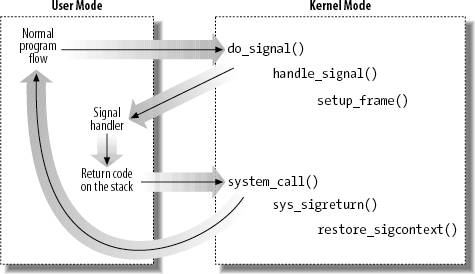

# Linux 中的信号

## 信号的使用

### 信号的概念

信号是通知进程发生了某件事的技术。每个信号都有一个名字，这些名字都以"SIG"开头。
需要注意的是，SIGUSR1和SIGUSR2这两个信号是给用户自定义的，可用于应用程序。

对于信号，内核有三种处理方式：

* 忽略。但有两种信号不能被忽略：SIGKILL和SIGSTOP，因为它们为超级用户提供了使进
程终止或停止的可靠方法。
* 捕捉信号。前提是要提前通知内核在某个信号发生时调用用户的某个函数。
* 执行系统默认动作。对大部分信号的默认动作是终止进程。

### signal函数

signal函数是关于信号最基本的函数。

    #include <signal.h>
    void (*signal(int signo, void (*func)(int)))(int);

这个函数非常不直观，用正常一点的语言来说就是：

* signal函数的返回指是一个函数地址，该函数没有返回值（void），并且需要一个int型
的参数。
* signal函数需要两个参数，第一个参数是signo，整型，代表信号名；第二个参数是func
，这是一个函数地址，该函数没有返回值（void），且需要一个int型的参数。
* 总的来说signal函数就是注册一个信号signo，当这个信号发生时，调用func函数去处理
，同时signal函数返回注册之前该信号的处理程序的指针。

参数func可以是`SIG_DFL`，代表使用默认处理动作，还可以是`SIG_IGN`，代表忽略，当
然更可以是其他具体的处理函数，这个函数就叫做**信号处理程序（signal handler）**
或者信号捕捉程序（signal-catching function），此时处理动作就叫做捕捉。

从signal的定义来看，不改变进程对信号的处理方式，就不能知道进程原本对信号的处理
方式，稍后介绍的sigaction函数能解决这个问题。

### 信号相关的术语

信号产生（generation）后，内核会递送（delivery）这个信号给进程，在产生和递送的
这个时间间隔内，称信号是“未决的（pending）”。

进程可以选择对一些信号“阻塞”，当为进程产生了一个信号，且进程对该信号设置了阻塞
，且进程对该信号的处理方式是默认或者捕捉，那么该进程就将该信号保持为未决
（pending）状态，直到阻塞被解除，或者进程对该信号的动作改为忽略。

如果进程对一个信号接触阻塞之前，该信号发生了多次，那么解除阻塞后，内核也只递送
这个信号一次。

每个进程都有一个“信号屏蔽字（signal mask），它规定了进程当前要阻塞的信号集。

### kill和raise函数

kill发送信号给进程或进程组。
raise允许进程发送一个信号给自己。

    #include <signal.h>
    int kill(pid_t pid, int signo);
    int raise(int signo);
    /* 成功时返回0，出错返回-1 */
    /* raise(signo) 等价于 kill(get_pid(), signo) */
    /*
    * 参数pid的4种不同情况：
    * pid > 0     发送给pid进程
    * pid == 0    发送给同一进程组的所有进程
    * pid < 0     发送给进程组ID等于pid绝对值的所有进程
    * pid == -1   发送给有权限发送的所有进程
    */

### alarm和pause函数

alarm函数用来设置一个定时器，定时器超时后会产生一个SIGALRM信号，对该信号的默认
处理方式是终结进程。

    #include <signal.h>
    unsigned int alarm(unsigned int secondes);
    /* 返回值：0或者以前设置的闹钟时间的余留秒树 */

如果在调用alarm时，以前也设置过一个闹钟且该闹钟还没有超时，那么该闹钟的余留时间
将作为这次alarm调用的返回值，以前登记的闹钟也会被新的闹钟所代替。

pause函数使调用进程挂起，直到接收到一个信号。

    #include <unistd.h>
    int pause(void);
    /* 返回-1，并将errno设置为EINTR */

### 信号集

数据类型`sigset_t`表示一个信集，有下面几个处理信号集的函数：

    #include<signal.h>
    int sigemptyset(sigset_t *set); /* 清空信号集 */
    int sigfillset(sigset_t *set);  /* 填满信号集，使其包含每一个可能的信号 */
    int sigaddset(sigset_t *set, int signo);
    int sigdelset(sigset_t *set, int signo);
    int sigismember(const sigset_t *set, int signo);

### sigprocmask和sigpending函数

进程有一个信号屏蔽字，它规定了当前阻塞哪些进程。调用`sigprocmask`函数可以检查和
更改进程的信号屏蔽字：

    #include <signal.h>
    int sigprocmask(int how, const sigset_t *restrict set,
                    sitset_t *restrict oset);
    /*
    * 成功返回0， 出错返回-1
    * 如果 oset 是非空指针，则进程之前的信号屏蔽字由 oset 返回
    * 若干 set 是非空指针，则根据不同的 how 对进程的信号屏蔽字做设置：
    * how = SIG_BLOCK，之前的屏蔽字 + set代表的屏蔽字
    * how = SIG_UNBLOCK，之前的屏蔽字 - set代表的屏蔽字
    * how = SIG_SETMASK，用 set代表的屏蔽字 代替之前的屏蔽字
    */

`sigpending`函数返回进程对当前进程处于pending状态的信号集。

    #include <signal.h>
    int sigpending(sigset_t *set);

### sigaction函数

`sigaction`函数检查或修改与指定信号相关的处理动作。它比`signal`函数直观且更容易
理解，事实上取代了老式的`signal`函数：

    #include <signal.h>
    int sigaction(int signo, const struct sigaction *restrict act,
                  struct sigaction *restrict oact);
    /* 成功返回0，错误返回-1 */

该函数使用一个名为`sigaction`的结构：

    struct siaction {
        void (*sig_handler)(int); /* signal handler OR SIG_IGN, SIG_DFL */
        sigset_t sa_mask;         /* 要阻塞的信号 */
        int sa_flags;
        void (*sa_sigaction)(int, siginfo_t *, void *); /* 替代的handler */
    };

参数说明：

* `sig_handler`表示handler函数的地址。
* `sa_mask`说明了一个信号集，当调用handler时，会把这个信号集里面的信号都加到屏
蔽字中，让它们都阻塞。
* `sa_flags`说明了一系列的参数。
* `sa_sigaction`是一个替代的handler，当`sa_flags`中出现了SA_SIGINFO时，就会调用
这个函数，该函数使用了一个`siginfo_t`类型的参数，它包含了一些这次信号相关的信息
。

### sigsuspend函数

`sigsuspend`函数设置进程的信号屏蔽字，然后在捕捉到一个信号或者发生了一个会终止
该进程的信号之前，该进程被挂起，而当接收到了信号且从信号处理程序返回时，进程的
信号屏蔽字又会恢复为调用`sigsuspend`函数之前的值。

    #include <signal.h>
    int sigsuspend(const sigset_t *sigmask);
    /* 返回值：-1，并将errno设置为EINTR */

### abort函数

`abort`函数将SIGABRT信号发送给调用进程。

    #include <stdlib.h>
    void abort(void);

### sleep函数

    #include <unistd.h>
    unsigned int sleep(unsigned int seconds);
    /* 返回值：0或者未休眠够的秒数 */

`sleep`函数使调用进程被挂起，直到下列条件之一被满足：

* 已经过了`seconds`指定的时间。
* 调用进程捕捉到一个信号并从信号处理程序返回。

## 信号在内核中的实现

对于信号，内核必须：

* 记住每个进程阻塞哪些信号。
* 当从内核态切换到用户态时，对任何一个进程都要检查是否有一个信号已经到达。这几
乎在每个定时中断时都发生。
* 确定是否可以忽略信号。
* 处理信号。

### 与信号有关的数据结构

对每个进程，内核必须跟踪什么信号当前正在挂起或被屏蔽，以及每个线程组是如何处理
所有信号的。这些信息都记录在进程描述符`task_struct`中，如下图所示：

在进程描述符中，几个重要的字段是：

* `struct signal_struct *signal` 是指向进程的信号描述符的指针，信号描述符用来
跟踪共享的挂起信号。当使用设置了`CLONE_THREAD`位的clone()系统调用来fork新进程时
，新的进程共享信号描述符。在`signal_struct`结构中有一个字段是
`struct sigpending share_pending`，该字段中存放共享挂起信号的数据结构。
* `struct sighand_struct *sighand` 是进程的信号处理程序描述符的指针。
* `sigset_t blocked` 表示被阻塞的信号集。
* `struct sigpending pending` 存放私有挂起信号的数据结构。

使用kill等系统调用，信号可以发送给整个线程组，也可以发送个特定的进程。所以，为
了跟踪当前pending的信号是什么，内核让每个进程关联了两个pending信号队列：

* 共享pending信号队列。位于`task_struct`的`signal`的`share_pending`字段，它存放
整个线程组的pending信号。
* 私有pending信号队列。位于`task_truct`的`pending`字段。

这两个字段都是`sigpending`结构，该结构定义为：

    struct sigpending {
        struct list_head list;
        sigset_t signal;
    };

其中，list是一个`sigqueue`结构的双向链表头。该链表表示了具体的信号的信息。

### 产生信号

很多内核函数都能产生信号，它们所做的工作事实上就是更新一个或多个的进程描述符，
然后唤醒一些进程，促使它们接收信号。

像一个进程发送信号的大致过程如下：

1. 检查进程是否忽略信号。
2. 检查私有pending信号队列上是否已经有另外一个相同的信号，有则什么都不做。
3. 调用`send_signal`把信号添加到进程的pending信号集中。
4. 通知进程有新的pending的信号，唤醒进程，如果进程已经在运行，则强制其重新调度
。因为在从调度函数返回时，每个进程都检查是否存在挂起的信号。

### 传递和执行信号

内核从内核空间恢复到用户空间执行前，会检查是否存在pending的信号。也就是说当内核
处理完一个中断或异常时就会做这样的检查。如果有pending的信号，则调用`do_signal`
函数处理。该函数首先考虑私有pending信号队列中的所有信号，从最低编号开始，然后再
考虑共享队列中的信号。

如果信号有一个专门的处理程序，`do_signal`调用`handler_signal()`调用信号处理程序
执行。

需要注意的是，信号处理程序是定义在用户态中的函数，而信号处理是在返回用户态前，
也就是在内核态中。另外，由于信号处理程序可以调用系统调用，这种情况下，执行了系
统调用的服务例程之后，控制权应该返回到信号处理程序而不是返回到被中断程序的正常
代码流。

于是，`do_signal`函数中会调用`setup_frame()`对用户态堆栈进行设置，使（1）恢复用
户态时首先执行的是信号处理程序，（2）信号处理程序结束时，通过`sigreturn`系统调
用把用户态堆栈硬件上下文拷贝到内核态堆栈，同时恢复用户态堆栈原始的状态。这时再
从内核态恢复到用户态时，就能执行“正常”的程序流程。

捕获一个信号的示意图如下：

----

参考资料：

* Man pages
* [UNIX环境高级编程](http://book.douban.com/subject/1788421/)
* [Linux内核设计与实现](http://book.douban.com/subject/6097773/)
