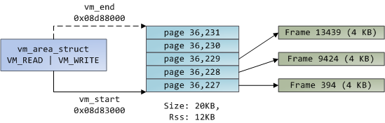
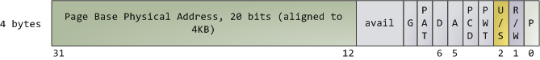
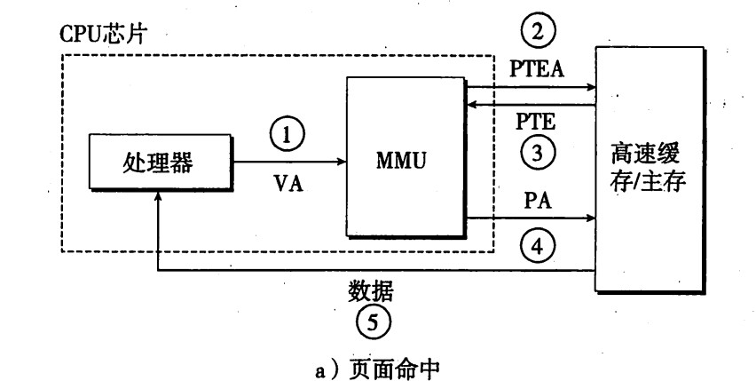
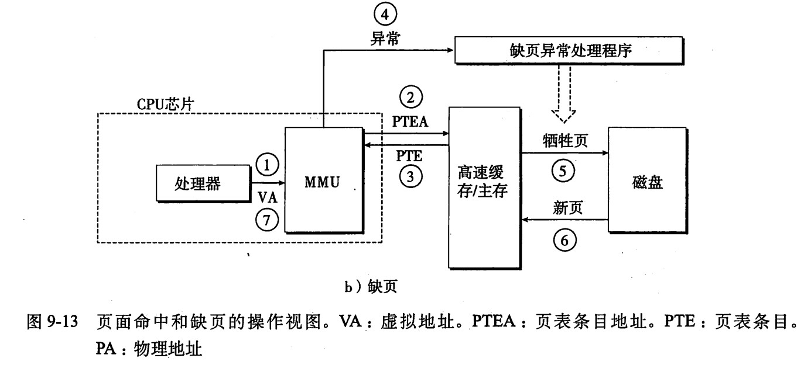
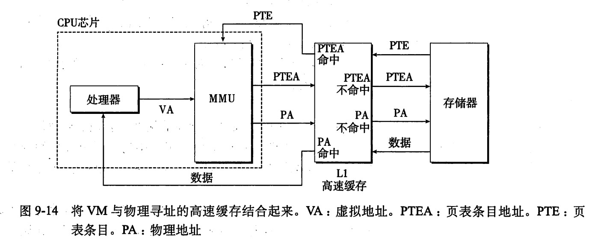
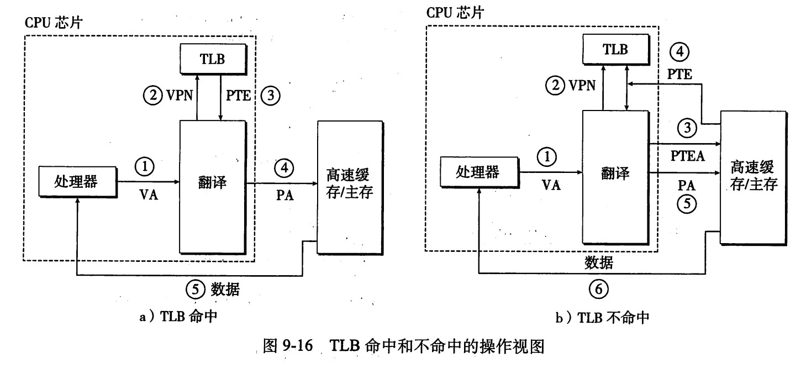
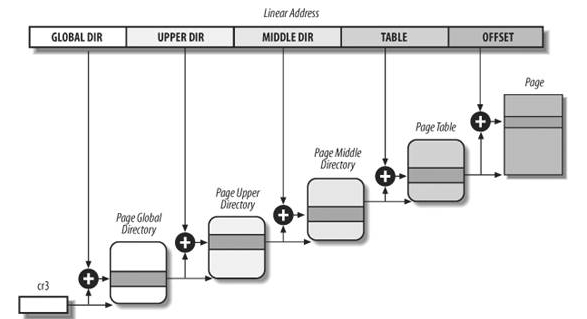

# Linux 内存管理(2): 分页

## 页(page)

线性地址空间被分割为一个个**页(page)**，32位系统中的页的大小通常为4K。
页内部连续的线性地址被映射到连续的物理地址中。每个VMA(虚拟内存区域，下面讲到）
的大小必须是页的整数倍。

## 页框(page frame)

分页单元把物理地址空间被分割为一个个的**页框(page frame)**。
处理器本身并不关心page frame，但是内核需要使用
page frame作为物理内存管理的单位。32位系统下，page frame的大小为4K，和虚拟内存
的page的大小一致。一个2G的物理地址空间结构示意图如下：

同一块物理内存可以被map到不同的页上，并且有不同的标志。

下图展示了一个进程的heap段中，虚拟内存空间（VMA）和物理内存页框(page frame)的关
系：

中间的这堆page表示了VMA的范围，一个页通过页表最终能找到物理内
存中对应的页框。有些页没有箭头，这表示它的页表项（PTE）中的`P`标志位为0，
这可能是由于这个页中的内容从来没有被用过，或者被交换出去了(swapped out)。
此时，对这个页的访问，就会引发一个“缺页异常(page fault)”，这是非常常见的。

## 页表(page tables)

把虚拟地址翻译为物理地址的过程是有软硬件联合完成的。包括操作系统，
MMU（存储器管理单元）中的地址翻译硬件和一个存放在内存中叫做
**页表(page tables)**的数据结构，页表将虚拟页映射到物理页。每次翻译时，翻译硬件
都会读取页表，操作系统负责维护页表的内容，以及在硬盘和物理内存中传输页。

每个进程都有自己的页表，
当前进程切换发生时，用户空间的页表也一起切换。每个进程的`task_struct`中的内存
描述符`mm_struct`中有一个域`pgd`，就指向这个进程的页表。

### 页表项

每个页在页表中都对应了一个**页表项(page table entry, PTE)**，一个32位
系统的页表项如下图：

内核可以读取或设置页表项的每一个标志，其中，

*   `P`表示这个内存页当前是否在物理内存中，为0时，表示该页不在物理内存中，此时
    PTE中的地址如果为空，表示这个页还没有分配，如果不为空，则代表这个页在硬盘上
    的位置。此时对这个页的访问将引发一个**缺页错误(page fault)**。这一位为0时，
    内核可以对其他的标志做任何设置。这一位为1时，PTE中的地址就代表该页在物理内
    存中的地址。
*   `R/W`标志表示是否是只读。`U/S`标志代表user/supervisor，为0时，这一页只能被
    内核访问。这些标志用于实现只读的虚拟内存以及用来保护内核空间。由于一个页中
    的所有内容都有同样的`R/W`，`U/S`等标志，所以页是内存保护的最小单位。
*   `D`和`A`标志表示**脏(dirty)**和**accessed**。当一个页发生过写操作，就说这个
    页是脏的，一个页被读或者写过，就说这个页是accessed的。对于这两个标志，进程
    只能去设置它们，但只有内核才能清除它们。

## 地址的翻译

虚拟地址到物理地址的翻译是由软硬件配合完成的。CPU中的一个寄存器，页表基址寄存器
(Page Table Base Register, PTBR)指向**当前**页表。对于一个n位的虚拟地址，可以分
为两部分：一个 p 位的虚拟页面便宜(Virtual Page Offset, VPO)，和一个 n-p 位的
虚拟页号(Virtual Page Number, VPN)。在命中的情况下，翻译的过程就是：

1. CPU生成一个虚拟地址，并传送给MMU；
2. MMU利用VPN来选择适当的PTE，继而找到对应物理页的起始地址；
3. 物理页面的起始地址再加上VPO，就得到了这个虚拟地址对应的物理地址。

注意，由于物理页面和虚拟页面大小相同，所以偏移也一样。

如果没有命中，则翻译过程是：

1. CPU生成一个虚拟地址，并传送给MMU。
2. MMU利用VPN来选择适当的PTE，发现PTE中的有效位是零，于是MMU就触发了一次异常。
3. 该异常导致CPU的控制被传递到操作系统内核中的缺页异常处理程序。
4. 缺页处理程序确定出物理内存中的牺牲页，如果该页面已经被修改，则把它换出到磁
盘。
5. 缺页处理程序调入新的页面，并更新PTE。
6. 缺页处理程序返回原来的进程，再次执行导致缺页的指令。这次就会命中。

### 使用高速缓存SRAM

在CPU和物理内存之间，还有几层高速SRAM高速缓存。对于地址翻译，SRAM中缓存的内容
是物理地址，也就是说，地址翻译发生在高速缓存查找之前，SRAM中有对页表条目的缓存
。

### 利用TLB加速地址翻译

MMU内部包括了一个关于PTE的小缓存，叫做
**翻译后备缓冲器(Translation Lookaside Buffer, TLB)**，这是一个虚拟寻址的小缓存
，每一行都保存着一个由单个PTE组成的块。加上TLB后，地址翻译的示意图如下：

### 页表的组织

基于效率的考虑，处理器一般都采用多级目录的方式来组织页表。从2.6.11版本之后，
Linux使用4级分页模型，如下图所示：

----

参考资料：

* [Linux内核设计与实现](http://book.douban.com/subject/6097773/)
* [深入分析Linux内核源码](http://oss.org.cn/kernel-book/ch06/6.3.1.htm)
* [深入理解Linux内核](http://book.douban.com/subject/2287506/)
* [深入理解计算机系统](http://book.douban.com/subject/5333562/)
* [The Linux Kernel](http://www.win.tue.nl/~aeb/linux/lk/lk.html)
* [Anatomy of a Program in Memory](http://duartes.org/gustavo/blog/post/anatomy-of-a-program-in-memory)
* [Memory Translation and Segmentation](http://duartes.org/gustavo/blog/post/memory-translation-and-segmentation)
* [How The Kernel Manages Your Memory](http://duartes.org/gustavo/blog/post/how-the-kernel-manages-your-memory)
* [Page Cache, the Affair Between Memory and Files](http://duartes.org/gustavo/blog/category/linux)
* [The Thing King](http://duartes.org/gustavo/blog/post/the-thing-king)
* [CPU Rings, Privilege, and Protection](http://duartes.org/gustavo/blog/post/cpu-rings-privilege-and-protection)
