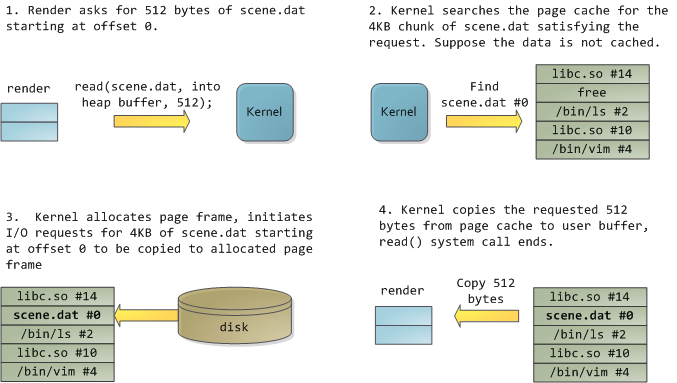

# Linux 内存管理(7): 页高速缓存

到目前为止我们知道的工作方式是：

内核有自己的内核空间，每个进程都有完整的虚拟空间。进程需要有一些匿名VMA，来存
Heap, Stack等等，还需要一些文件VMA，映射一些库文件或者是需要读写的文件。
进程对内容的变更，一开始只发生在虚拟空间，只是对VMA做一些修改或创建。
VMA下的虚拟内存以“虚拟页”为单位管理，虚拟页的大小和物理页一样，虚拟页通过“页表”
来找到对应的物理页。如果找不到，说明当前需要操作的内容不在物理内存中，于是内核
通过分配物理内存，或者映射文件到物理内存，这时才是对物理内存的真的操作。
“物理页”或者简单地说“页”是内核管理物理内存的单位。内核需要满足很多进程的需要以
及自身的需要，通过 "page fault" 的方式，把合适的内容放到物理内存中。

现在我们的问题是：

物理内存很小，可能小于单个进程的虚拟空间大小，内核如何让多进程共享这一块地方？
硬盘的速度比内存慢好几个数量级，内核如何让进程快速地访问到需要的文件，如何让进
程感觉到快速地把内容写入硬盘？

## 概念

简单地说，Page Cache就是对硬盘上的内容在物理内存中做一个缓存。
当进行一个I/O操作，比如read()系统调用时，内核首先检查数据是否已经存在于页高速
缓存中了。

Page Cache中每个页所包含的数据肯定属于某个文件。这个文件（或者更准确地说是文件
的索引节点）就成为页的所有者。

硬盘中的数据以“块”为单位组织，“块”的大小往往小于页的大小，于是有可能
**一个页中的内容来自与多个不同的不连续的磁盘块**。（事实上，一个页的大小通常是
4KB，但是多数文件系统中，块的大小都是512 bytes。）
所以不能用设备号和块号来识别它，而是通过页的所有者（代表了一个文件）和所有者数
据中的索引（通常是一个索引节点和在相应文件中的偏移量）来识别页高速缓存中的页。

### 写缓存--回写

Linux采用称为“回写”的写缓存。程序执行写操作直接写到缓存中，后端存储不会立刻直接
更新，而是将页高速缓存中被写入的页面标记成“脏”，并且被加入到脏页链表中。然后由
一个进程周期性将脏页链表中的页写回到硬盘，从而让硬盘中的数据和内存中最终一致。
最后再清理“脏”页标识。

### 缓存回收

当物理内存空间紧张时，内核需要把已经缓存着的内容选择一部分清除。内核首先会选择
干净的（不脏的）页面进行替换。当没有足够的干净页面时，内核就通过所谓预测算法来
会找出那些以后最不可能使用的页面。

**LRU算法**

我们先了解一下缓存中的LRU算法，或者叫“最近最少使用算法。可以把LRU算法理解成一个
链表，每访问一个页就把该页加到链表的尾部，而清理总是选择链表头部的页来做。这种
方式有个问题：如果我们有一些只会访问一次的文件，按照LRU算法这些文件也会被缓存，
但显然这些文件不应该被缓存才对。

**双链策略和LRU/n算法**

Linux使用的是一个修改过的LRU算法，叫做双链策略。内核维护了两个链表：活跃链表和
非活跃链表。处于活跃链表上的内容被认为是”热“的且不会被换出，而在非活跃链表上的
页面则是可以被换出的。在活跃链表中的页面必须在其被访问时就处于非活跃链表中。两
个链表都被“伪LRU”规则维护：页面从尾部加入，从头部移除。两个链表需要维持平衡——
如果活跃链表变得过多而超过了非活跃链表，那么活跃链表的头页面将被重新移到非活跃
链表中以便能再被回收。这种双链表的方式也称为LRU/2。更普遍的方式是n个链表，称为
LRU/n。

缓存中的页来自对文件的读写，包括普通文件，块设备文件和内存映射文件。

## 数据结构

### `address_space`对象

`address_space`结构是虚拟地址VMA结构体`vm_area_struct`的物理地址对等体。但一个
文件可以被10个`vm_area_struct`标识（比如5个进程，每个调用mmap()映射它两次），这
个文件只能有一个`address_space`，也就是文件可以有多个虚拟地址，但只能在物理内存
有一份。该结构定义在`<linux/fs.h>`中：

    struct address_space {
        struct inode            *host;              /* owner: inode, block_device */
        struct radix_tree_root  page_tree;          /* radix tree of all pages */
        spinlock_t              tree_lock;          /* and lock protecting it */
        unsigned int            i_mmap_writable;    /* count VM_SHARED mappings */
        struct prio_tree_root   i_mmap;             /* tree of private and shared mappings */
        struct list_head        i_mmap_nonlinear;   /* list VM_NONLINEAR mappings */
        struct mutex            i_mmap_mutex;       /* protect tree, count, list */
        /* Protected by tree_lock together with the radix tree */
        unsigned long           nrpages;            /* number of total pages */
        pgoff_t                 writeback_index;    /* writeback starts here */
        const struct address_space_operations *a_ops;   /* methods */
        unsigned long           flags;              /* error bits/gfp mask */
        struct backing_dev_info *backing_dev_info;  /* device readahead, etc */
        spinlock_t              private_lock;       /* for use by the address_space */
        struct list_head        private_list;       /* private address_space list */
        struct address_space    *assoc_mapping;     /*  */
    }

每个[页描述符（struct page）](2013-11-07-mm_03_page_frame_manage.md)中都有两个字段：
"mapping"和"index"，mapping 字段指向了一个`address_space`结构，该结构对应的索引
节点所对应的文件中的某段内容，正是这个page上的内容（或者说应该是这个page上的内
容）。具体是那段内容就由`index`参数之指出，它以页大小作为单位，指出了该部分内容
的偏移量。

`page_tree`表示了一个由拥有者（文件的inode）的所有页组成的基树（radix tree）的
根。通过这颗树，内核就可以快速搜索，看所需要的页是否在页高速缓存中。

内核在页高速缓存中查找页时，正是用的这两个参数。

`i_mmap`是一个优先搜索树，可以理解为内核通过这颗树把这个`address_space`中的所有
映射组织起来，包括共享映射和似有映射（下面会讲到）。也就是说，这颗树由所有映射
到这个`address_space`的VMA组成。`i_mmap`表示的树-- "Radix tree"是一个二叉树，只
要指定了文件偏移量，就可以在树中迅速找到需要的映射。这颗树的主要作用是“反向映射
”，这是为了快速标识共享一页的所有进程，这主要用在页框回收过程（之后会讲到）。

`nrpages`表示一共有多少个page在其中。

如果`address_struct`中的`host`不为NULL，表示它与一个 inode 关联。

`a_ops`指向一个操作函数表，和VFS类似，函数表用`address_space_operations`
结构体表示。其中最主要的几个功能是：读/写页，标记页为脏，释放页，直接IO操作等。

每种FS都有自己的`address_space_operations`，描述自己如何与页高速缓存交互。

读取一个页面包含下面这些操作：

*   首先内核使用`find_get_page()`试图在页高速缓存中找到需要的数据（使用
    Radix Tree 搜索）:

        page = find_get_page(mapping, index)
        /* mapping 指定 address_space, index以页为单位指定文件中的位置 */

*   如果没有搜索到，`find_get_page()`返回NULL，内核将分配一个新页面，然后将之前
    搜索的页加入到页高速缓存中：

        page = page_cache_alloc_cold(mapping);
        add_to_page_cache_lru(page, mapping, index, GFP_KERNEL)

*   最后,需要的数据从磁盘被读入，再被加入页告诉缓存，然后返回给用户：

        mapping->a_ops->readpage(file, page)

**写入**

对于文件映射来说，当页被修改了，仅需要标记页面为脏：`SetPageDirty(page)`即可，
内核晚些时候会通过`writepage()`方法把页写出。

对于特定文件，一般情况下，1. 页高速缓存中搜索需要的页，如果没找到，那么内核
就在高速缓存中新分配一空闲项；2. 然后内核创建一个写请求；3. 数据被从用户空间
拷贝到了内核缓冲；4. 数据被写入磁盘。

**flusher线程和pdflush线程**

在以下3中情况发生时，脏页被写回磁盘：

*   当空闲内存低于特定的一个阈值时
*   当脏页在内存中驻留时间超过一个特定的阈值时
*   当用户进程调用sync()和fsync()系统调用时

回写的阈值和一些参数可以在`/proc/sys/vm`中做设置。

在2.6.32之前的版本，回写操作是由 pdflush(page dirty flush) 完成的。pdflush线程
的数目是动态的，目的在于，由于磁盘读写速度很慢，对于多个磁盘的情况，我们不希望
线程卡在某个拥塞的磁盘上。

在2.6.32之后，内核使用了flusher线程代替pdflush，flusher线程和具体块设备关联，
相当于一个磁盘一个flusher线程，简单有效。

## 例子

借用[Page Cache, the Affair Between Memory and Files](http://duartes.org/gustavo/blog/post/page-cache-the-affair-between-memory-and-files)
中的一个例子：程序叫 render ，它打开文件 scene.dat，读取512字节的数据，这些数据
会存放在它的虚拟内存空间中的Heap段。

图中带标号的表示物理内存中的一个页，根据`address_space`结构的分析我们知道，通过
文件和偏移（以页为单位），如果已经缓存的话，可以在page cache中找到这页内容。

经过上图的过程，也就是首先内核读取文件的一部分到page cache，然后从page cache中
拷贝到用户空间的匿名VAM即Heap，可以看到，经过一次`read()`调用，这部分内容事实
上在物理内存中存了两份：

# The Thing King

关于这一切是如何工作的，有一篇很有趣的文章
* [The Thing King](http://duartes.org/gustavo/blog/post/the-thing-king)，作者是写[Expert C Programming](http://book.douban.com/subject/1784687/)的 Peter van der Linden 。

----

参考资料：

* [Linux内核设计与实现](http://book.douban.com/subject/6097773/)
* [深入分析Linux内核源码](http://oss.org.cn/kernel-book/ch06/6.3.1.htm)
* [深入理解Linux内核](http://book.douban.com/subject/2287506/)
* [The Linux Kernel](http://www.win.tue.nl/~aeb/linux/lk/lk.html)
* [Anatomy of a Program in Memory](http://duartes.org/gustavo/blog/post/anatomy-of-a-program-in-memory)
* [Memory Translation and Segmentation](http://duartes.org/gustavo/blog/post/memory-translation-and-segmentation)
* [How The Kernel Manages Your Memory](http://duartes.org/gustavo/blog/post/how-the-kernel-manages-your-memory)
* [Page Cache, the Affair Between Memory and Files](http://duartes.org/gustavo/blog/category/linux)
* [The Thing King](http://duartes.org/gustavo/blog/post/the-thing-king)
* [CPU Rings, Privilege, and Protection](http://duartes.org/gustavo/blog/post/cpu-rings-privilege-and-protection)

