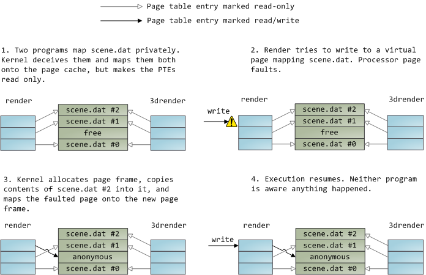
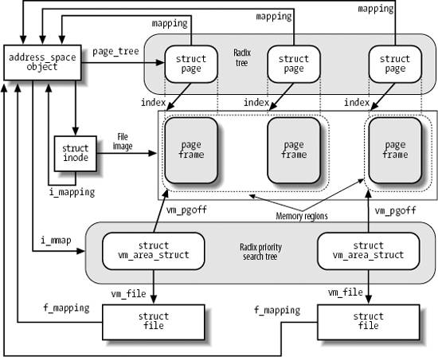

# Linux 内存管理(8): 内存映射

上一篇讨论“页页高速缓存中”说过：

> `read()`调用首先把数据从磁盘拷贝到page cache，再从page cache拷贝到用户空间，
> 发生了两次拷贝。通过**内存映射文件（Memory-mapped files)**可以避免这个问题。

### 内存映射

当使用内存映射文件时，内核把程序的虚拟页直接map到page cache。但不是所有内容都
马上从磁盘读取到物理内存中，而是通过 page fault ，在需要的时候才从磁盘读取。

文件映射有两种类型：**私有的(private)**或者是**共享的(shared)**，它们的区别只有
在内容被更新时才能体现出来。通过在mmap()系统调用中指定`MAP_SHARED`标志或者
`MAP_PRIVARITE`标志来表示不同类型的映射。

如果是共享的，进程对映射中的一个页进行写，则这种
修改对于映射了这同一个文件的所有进程来说都是可见的。

当进程创建的映射只是为读文件，而不是写文件时才会使用似有映射。如果是私有映射，
对内容的更新不会回写到磁盘，其它map此文件的进程也看不到。这是通过**写时复制**机
制保证的。

共享内存映射的页通常都包含在页高速缓存中，私有内存映射的页只要还没有被修改，也
都包含在页高速缓存中。当进程试图修改一个私有内存映射的页时，内核就把该页框进行
复制，并在进程页表中用复制的页来替换原来的页框。这就是所谓的“写时复制”机制。

下图中的两个进程，reander有读写操作，3dreander只有读，他们都通过私有的方式映射
了文件 scene.dat ：

动态加载的库文件就是通过文件映射映射到进程空间的，一副“全景图”如下：

### 内存映射的数据结构

内存映射可以用下列数据结构的组合来表示：

* 与所映射的文件相关的inode对象
* 所映射文件的`address_space`对象
* 不同进程对一个文件进行不同映射所使用的文件对象
* 对文件进行每一个不同映射所使用的`vm_area_struct`描述符
* 对文件进行映射的VMA所分配的每个页框所对应的页描述符

下图说明了这些数据结构是如何链接在一起的：

图中，inode的`i_mapping`字段指向文件的`address_space`对象。每个`address_space`
对象的`page_tree`字段又指向该地址空间的页的基树(page_tree)，另外`i_mmap`字段指
向第二课树，即由VMA组成的radix优先级搜索树。参考前文
[“页高速缓存”](2013-11-10-mm_07_page_cache.md)。每个`vm_area_struct`都有一个`vm_file`字段，
与所映射的文件对象链接（如果该字段为NULL，则VMA没有用于内存映射）。第一个映射
单元的位置，即以页大小作为单位的偏移量，存放在`vm_area_struct`中的`vm_pgoff`字
段，所映射的文件部分的长度就是VMA的大小，通过`vm_start`和`vm_end`计算出来。

内存映射最终也是通过“缺页异常”来工作的。事实上，一个新建立的内存映射就是一个不
包含任何页的VMA。当进程引用VMA中的一个地址时，缺页异常发生，缺页异常中断处理程
序检查线性区的nopage方法是否定义。如果没有定义nopage，则说明VMA不映射磁盘上的文
件;否则，进行映射，通过访问块设备处理读取的页。

----

参考资料：

* [Linux内核设计与实现](http://book.douban.com/subject/6097773/)
* [深入分析Linux内核源码](http://oss.org.cn/kernel-book/ch06/6.3.1.htm)
* [深入理解Linux内核](http://book.douban.com/subject/2287506/)
* [The Linux Kernel](http://www.win.tue.nl/~aeb/linux/lk/lk.html)
* [Anatomy of a Program in Memory](http://duartes.org/gustavo/blog/post/anatomy-of-a-program-in-memory)
* [Memory Translation and Segmentation](http://duartes.org/gustavo/blog/post/memory-translation-and-segmentation)
* [How The Kernel Manages Your Memory](http://duartes.org/gustavo/blog/post/how-the-kernel-manages-your-memory)
* [Page Cache, the Affair Between Memory and Files](http://duartes.org/gustavo/blog/category/linux)
* [The Thing King](http://duartes.org/gustavo/blog/post/the-thing-king)
* [CPU Rings, Privilege, and Protection](http://duartes.org/gustavo/blog/post/cpu-rings-privilege-and-protection)

