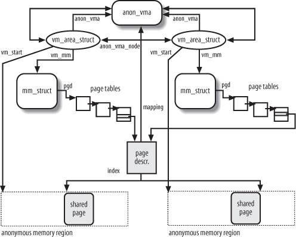

# Linux 内存管理(9): 回收页框

在[“页高速缓存”](2013-11-10-mm_07_page_cache.md)一文中简单介绍了页高速缓存的回收：

> 当物理内存空间紧张时，内核需要把已经缓存着的内容选择一部分清除。内核首先会选择
> 干净的（不脏的）页面进行替换。当没有足够的干净页面时，内核就通过所谓预测算法来
> 会找出那些以后最不可能使用的页面。
>
> **LRU算法**
>
> 我们先了解一下缓存中的LRU算法，或者叫“最近最少使用算法。可以把LRU算法理解成一个
> 链表，每访问一个页就把该页加到链表的尾部，而清理总是选择链表头部的页来做。这种
> 方式有个问题：如果我们有一些只会访问一次的文件，按照LRU算法这些文件也会被缓存，
> 但显然这些文件不应该被缓存才对。
>
> **双链策略和LRU/n算法**
>
> Linux使用的是一个修改过的LRU算法，叫做双链策略。内核维护了两个链表：活跃链表和
> 非活跃链表。处于活跃链表上的内容被认为是”热“的且不会被换出，而在非活跃链表上的
> 页面则是可以被换出的。在活跃链表中的页面必须在其被访问时就处于非活跃链表中。两
> 个链表都被“伪LRU”规则维护：页面从尾部加入，从头部移除。两个链表需要维持平衡——
> 如果活跃链表变得过多而超过了非活跃链表，那么活跃链表的头页面将被重新移到非活跃
> 链表中以便能再被回收。这种双链表的方式也称为LRU/2。更普遍的方式是n个链表，称为
> LRU/n。
>
> 缓存中的页来自对文件的读写，包括普通文件，块设备文件和内存映射文件。

本文从整体的角度梳理一下Linux内核对页框的回收。

## 页框回收算法PFRA

随着系统不断允许，迟早所有的空闲内存将被分配给进程和高速缓存。Linux内核的页框
回收算法（page frame reclaiming algorithm, PFRA）采取从用户态进程和页高速缓存
“窃取”页框的方法，补充伙伴系统的空闲列表。

根据页框的内容，可以把页框分为4类：不可回收页，可交换页，可同步页和可丢弃页。
具体如下：

**不可回收页**

不可回收页不允许也无需回收。包括空闲页、保留页、内核动态分配页、进程内核态堆栈
页，临时锁定页，内存锁定页。

**可交换页**

对于可交换页，必要时会把页的内容保存在交换区（swap）。包括用户态地址空间的匿名
页，tmpfs文件系统的映射页（比如IPC共享内存的页）。所谓匿名页，是指它属于一个进
程的某个匿名VMA，比如，进程的用户态堆和栈中的页都为匿名页。

**可同步页**

对于可同步页，必要时，与硬盘映像同步这些页。包括用户态地址空间的映射页，存有磁
盘文件数据且在页高速缓存中的页，块设备缓冲区页，某些磁盘高速缓存的页（如索引节
点高速缓存）。所谓映射页就是指该页映射了一个文件的某个部分。同步时，需要检查页
是否为脏，必要是需要把页的内容写回到硬盘中。

**可丢弃页**

对于可丢弃页无需操作。包括内存高速缓存中未使用的页（如slab分配器高速缓存），目
录项高速缓存的为使用页。

粗略地说，任何属于磁盘和内存高速缓存的页，以及属于进程用户态地址空间的页，都是
可回收的。

当PFRA必须回收属于某进程用户态地址空间爱你的页框时，它必须考虑页框是否是共享的
。当进程创建子进程时，父子进程就共享一些页框。另外当多个进程以内存映射的方式访
问同一个文件时，这部分页框也是共享的。

### 页框回收算法总的原则

页框回收算法是一种相当经验性的工作，很少有理论支持。PFRA的实现也非常复杂。我们
主要看看在PFRA采用的几个总的原则。

**释放“无害”的页**

在回收进程用户态地址空间之前，必须先回收磁盘与内存高速缓存中的页。因为回收这些
页并不需要修改任何页表项。上面介绍的“双链策略和LRU/n算法”正是用来回收页高速缓存
中的页框的。

**将用户态进程哦所有页定位可回收页**

除了锁定页，PFRA必须能够窃取任何用户态进程页，包括匿名页。这样，睡眠较长时间的
进程将逐渐失去所有页框。

**同时取消引用一个共享页框的所有页表项的映射，就可以回收该共享页框**

当PFRA要释放几个进程共享的页框时，它就清空引用该页框的所有页表项，然后回收该
页框。至于怎么找到共享一个页框的所有页表项，我们下面再看。

**只回收“未用”页**

PFRA把页框分为“在用(in_use)”和“未用(unused)”，类似页与上面介绍的LRU算法的双链。
思想就是：如果某页很长时间没有访问，那么它将来被访问的可能性较小，就可以将它看
作未用;如果某页最近被访问过，那么它将来被访问的可能性较大，就把它看作在用。

### 反向映射

下面我们看看怎么找到共享一个页框的所有页表项。内核中使用所谓“反向映射”的技术来
实现这一点。简单地说，反向映射就是通过一系列的链接，让内核能够方便地从一个页框
找到所有指向这个页框的页表项。

#### 映射页的反向映射

首先，页(struct page)结构中有这样一个字段

    struct address_space *mapping

它就指向这个页属于的`address_space`，而在`struct address_space`中又包含了o

    struct prio_tree_root   i_mmap;   /* tree of private and shared mappings */

`i_mmap`指向的树又包含了所有映射到这个`address_space`的VMA。而在VMA的结构
`struct vm_area_struct`中又有

    struct mm_struct * vm_mm;    /* 关联的mm_struct. */

指向了进程的内存描述符`mm_struct`，从`mm_struct`就能找到页全局目录：

    pgd_t  *pgd;           /* 页全局目录 */

这样一步步“反向映射”过来，就能通过一个页框，找到所有指向这个页框的页表项。

#### 匿名页的反向映射

匿名映射经常是由几个进程共享的，比如在创建子进程时，父进程的所有页框，包括匿名
页，同时也分配给子进程。

将引用同一个页框的所有匿名页链接起来的策略很简单，就是把该页框所在的匿名VMA存放
在一个双向循环列表中。不过需要注意的是，即使一个VMA中包含了不同的页，也只有一个
双链表用把匿名VMA链接起来，该链表就被用于该VMA中的所有页。

让我们具体来看一看。

当为一个匿名VMA分配第一页时，内核创建一个新的`anon_vma`
数据结构，它代表了VMA双向循环列表的头。然后内核把这个VMA插入到链表中。在
`vm_area_struct`结构中有两个字段`anon_vma_node`和`anon_vma`，前者指向了链表
中的前后匿名VMA，后者指向了链表的头。最后，内核把`anon_vma`即链表头的位置放到了
页描述符`struct page`的`mapping`字段。

当已经被一个进程引用的页框插入另一个进程的页表项时（比如使用fork()系统调用时）
，内核就把第二个进程的匿名VMA插入第一个进程匿名VMA所在的链表中。

匿名页的反向映射结构图如下：

## 交换(swapping)

### 原理

交换(swapping)用来为非映射页在磁盘上提供备份。有三类页
需要由交换子系统处理:

* 属于进程匿名VMA（如用户态堆和栈）的页。
* 属于进程私有内存映射的脏页。
* 属于IPC共享内存区的页。

交换对于程序是透明的。大概原理如下：

每个页表项有一个P标志（Present标志），
这个标志表示这个内存页当前是否在物理内存中，内核通过这个标志就知道这个页是否被
换出(swap out)。除了这个标志，内核还利用页表项中的其他位来存放换出页标识符(
swapped-out page identifier)。该标识符用于编码换出页在磁盘上的位置。当缺页异常
发生时，相应的异常处理程序可以检测到该页不再RAM中，然后调用函数从磁盘换入需该
缺页。

### 交换区

从内存中换出的页存放在交换区（swap area）中。交换区可以是一个磁盘分区，也可以是
一个文件，一个系统可以定义多种不同的交换区。

每个交换区都由一组页槽（page slot）组成，所谓页槽就是只页大小（一般4096字节）的
块，每快中包含一个换出的页。交换区的第一个页槽用来永久存放有关交换区的信息。

----

参考资料：

* [Linux内核设计与实现](http://book.douban.com/subject/6097773/)
* [深入分析Linux内核源码](http://oss.org.cn/kernel-book/ch06/6.3.1.htm)
* [深入理解Linux内核](http://book.douban.com/subject/2287506/)
* [The Linux Kernel](http://www.win.tue.nl/~aeb/linux/lk/lk.html)
* [Anatomy of a Program in Memory](http://duartes.org/gustavo/blog/post/anatomy-of-a-program-in-memory)
* [Memory Translation and Segmentation](http://duartes.org/gustavo/blog/post/memory-translation-and-segmentation)
* [How The Kernel Manages Your Memory](http://duartes.org/gustavo/blog/post/how-the-kernel-manages-your-memory)
* [Page Cache, the Affair Between Memory and Files](http://duartes.org/gustavo/blog/category/linux)
* [The Thing King](http://duartes.org/gustavo/blog/post/the-thing-king)
* [CPU Rings, Privilege, and Protection](http://duartes.org/gustavo/blog/post/cpu-rings-privilege-and-protection)

