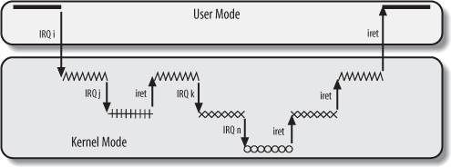
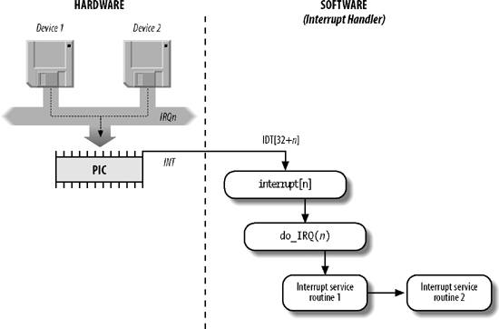

# Linux 中断和异常

### 异常

**异常（exception）**就是控制流中的突变，用来响应处理器状态中的某些变化。
其基本思想就是：

       Application
           ||
           ||
    I(curr)||-------Exception---->|| 异常处理
    I(next)||<-----+              ||
           ||      |              ||
           ||      +--------------\/
           \/

处理器在执行当前指令I(curr)，此时发生了一些处理器状态的突变（事件），于是控制流
转移到对异常的处理，处理之后又继续回到原来应用程序的控制流中，此时会发生三种情
况：

*   继续执行下一个指令I(next)；
*   重新执行刚才的指令I(curr)；
*   程序被终止；

异常机制的一部分是由硬件实现的，另一部分是由操作系统实现的。系统中可能的每种类
型的异常都分配了一个唯一的非负整数的**异常号（exception number）**，掐中一些号
码是由处理器的设计者分配的，另外一些则由操作系统内核的设计者分配。前者包括被零
除、缺页、内存方位违例、断点以及算数溢出等，后者包括系统调用、来自外部的信号等
。

在系统启动时，操作系统初始化一张称为**异常表**的跳转表，使得条目k包好的就是异常
k的处理程序的地址。异常表的地址存放在一个叫“异常表基址寄存器（exception table
base register）的特殊CPU寄存器里。

这张异常表又叫中断描述符表（Interrupt Descriptor Table, IDT），IDT的地址存
放在`idtr`寄存器中。中断发生时，内核就从IDT中查询相应中断的处理信息。
内核启动中断以前，必须把IDT表的初始地址装到idtr寄存器，并初始化表中的每一项。

### 异常的类别

异常可以分为四类：

    类别                原因                异步/同步   返回行为
    中断(interrupt)     来自IO设备的信号    异步        总是返回到下一条指令
    陷阱(trap)          有意的异常          同步        总是返回到下一条指令
    故障(fault)         潜在可恢复的错误    同步        可能返回到当前指令
    终止(abort)         不可恢复的错误      同步        不会返回

上面提到了异步和同步，简单地说，“异步”表示你不知道它什么时候来，比如你不知道一
个IO设备的电信号什么时候发过来。“同步”表示这种异常正是由于当前执行的指令导致的
，比如当前的指令正是被零除。

**中断**

中断是一种电信号，由硬件设备生成，并送入中断控制器的输入引脚中，中断控制器会给
CPU发送一个电信号，CPU检测到这个信号，就中断当前的工作转而处理中断。中断又分为
“可屏蔽中断（maskable interrupt）”和“非屏蔽中断（nonmaskable interrupt)”。可屏
蔽中断可以处于屏蔽（masked）状态或者非屏蔽（unmasked）状态，控制单元会忽略处于
屏蔽状态的中断。只有几个危急事件（如硬件故障）才会引起非屏蔽中断。

**故障（fault）**

故障由错误情况引起，它可能能够被故障处理程序修正。最经典的就是
“缺页故障(page fault)”，当指令引用一个虚拟地址，该虚拟地址对应的物理页面不在内
存中时，就发生page fault，此时缺页处理程序从磁盘加载适当的页面，然后将控制返回
给引起故障的指令。指令会再次执行，这次由于需要的页面已经在内存中了，所以故障就
不再出现。

**陷阱（trap）**

“陷阱(trap)”是有意的异常，其最重要的作用是在用户程序和内核之间提供一个像过程一
样的接口，即“系统调用”。和故障的区别就是，当一个trap发生时，内核仅仅报告这个陷
阱发生了，但不会重新执行引发trap的指令。trap另外还被用在调试程序时，比如到了一
个程序内的断点，中断信号的作用就是通知调试程序这条设置了断点的特殊语句已经被执
行。

**异常终止（abort）**

abort代表发生了一个严重的错误，不能在eip寄存器中保存引起异常的指令所在的确切
位置。abort会强制受影响的进程终止。

### 异常表的示例

    异常号      描述                异常类型
    0           除法错误            fault
    13          一般保护故障        fault
    14          缺页                fault
    18          机器检查            abort
    32-127      操作系统定义的异常  interrupt/trap
    128(0x80)   系统调用            trap
    129-255     操作系统定义的异常  interrupt/trap

很多原因都会导致所谓的**一般保护故障**，比如引用了一个未定义的虚拟内存地址，或
者试图写一个只读的文本段等。Shell一般会把这种故障报告为“Segment Fault”。

需要注意的是，有些厂商的文档中，“异常”仅仅指同步异常（故障，陷阱和终止）而
“中断”作为另外一种概念。另外关于异常和中断的概念不同的书中理解的不太一样，尽管
思想都是一样的。本文的这些概念的阐释参考的是《深入理解计算机系统》第8章，使用
“异常”作为一个通用的术语。

### IRQ

IRQ全称为Interrupt Request，即“中断请求”。IRQ的作用就是执行硬件中断请求的动作.
每个能够发出中断的硬件的控制器（某个芯片）中，都有一条名为
**IRQ（Interrupt Request）**的输出线。所有的IRQ线（IRQ line）都连接到一个叫做
“可编程中断控制器（Programmable Interrupt Controller, PIC）”的硬件电路连接。
PIC负责把中断请求转化为IRQ编号，然后和CPU交互让CPU知道发生了什么中断。
不同的IRQ编号代表不同的中断请求，共有16组的IRQ。比如，在经典PC机上，IRQ 0是时钟
中断，IRQ 1是键盘中断。

几个设备可以共享同一个IRQ编号。除了几个IRQ编号留给特定的设备，其
余的都被动态地处理，内核可以把同一个编号的IRQ让几个硬件设备一起使用。原理就是使
这些硬件设备的活动串行化，以便一次只能有一个设备使用这个编号的IRQ。

### 上半部和下半部的概念

有时候中断处理需要做的工作很多，而中断处理程序的性质要求它必须在尽量短的时
间内处理完毕，所以中断处理的过程可以分为两部分或者两半（half）。中断处理程序属
于“上半部（top half）”--接受到一个中断，立刻开始执行，但只做有严格时限的工作。
能够被允许稍微晚一点完成的工作会放到“下半部（bottom half）中去，下半部不会马上
执行，而是等到一个合适的时机调度执行。也就是说，关键而紧急的部分，内核立即执行
，属于上半部；其余推迟的部分，内核随后执行，属于下半部。

比如说当网卡接收到数据包时，会产生一个中断，中断处理程序首要进行的工作是通知硬
件拷贝最新的网络数据包到内存，然后读取网卡更多的数据包。这样网卡缓存就不会溢出
。至于对数据包的处理和其他随后工作，则放到下半部进行。关于下半部的细节，我们后
面会讨论。

### 中断统计信息

在/proc/interrupts中可以查看当前系统的中断统计信息。

## 中断上下文和中断栈

当内核栈的大小为两页时，中断程序使用进程的内核栈作为中断栈，但当内核栈为一页时
，每个处理器就会拥有一个中断栈。

>在每一个进程的生命周期中，必然会通过到系统调用陷入内核。在执行系统调用陷入内核
>之后，这些内核代码所使用的栈并不是原先用户空间中的栈，而是一个内核空间的栈，
>称作进程的“内核栈”。
>
>内核为每个进程分配了一个内核栈，事实上每个进程的内核栈和它的`thread_info`结构
>在一起。
>
>每个进程的内核栈大小既依赖体系结构，也与编译时的选项有关。历史上每个进程都有两
>页大小内核栈（对于32位系统是4x2=8K，64位系统是8x2=16K大小）。
>
>随着机器运行时间的增加，寻找两个未分配的、连续的页变得越来越困难，物理内存渐渐
>变为碎片，因此给一个新进程分配虚拟内存的压力也在增大。所以后来内核多了一个编译
>选项，可以选择内核栈为1页。现在，对于32位系统，默认内核栈为2页，可以选择设置
>为一页。而对于64位系统，则固定为两页(8K)。
>
>如果内核栈为2页，中断处理程序也会使用它们中断的进程的内核栈。事实上这个内核栈
>会被用于所有类型的内核控制路径：异常、中断（硬件中断）、和可延迟函数（软中断和
>tasklet）。
>
>如果编译时指定定内核栈大小为1页，则: 1. 每个进程都会有一个独立的异常栈，用于
>异常处理，这个栈包含在每个进程的`thread_union`结构中。2. 每个CPU有一个硬中断
>请求栈，大小为一页，用于处理中断。3. 每个CPU都有一个软中断请求栈，大小为一页，
>用于处理可延迟函数。

中断处理程序运行在中断上下文中(interrupt context)，该上下文中的代码不可以阻塞。
注意和进程上下文的区别，进程上下文是一种内核所处的操作模式，此时内核代表进程
执行，比如执行一个系统调用或者运行内核线程。在进程上下文中，可以通过current宏
关联当前进程。不同的进程以进程上下文的方式连接到内核中，所以，进程上下文可以
睡眠，也可以调用调度程序。由于没有后备进程，所以**中断上下文不可以睡眠**，因为
根本没办法对它重新进行调度。要注意，中断处理程序执行的代码不是一个进程，它是一
个内核控制路径，中断程序代表了被中断的进程来执行。作为一个内核控制路径，中断处
理程序比一个进程要“轻”，也就是说，中断的上下文很少，建立或终止中断处理需要的时
间很少。

## 中断和异常处理程序的嵌套执行

上面说过，每个中断和异常都会引起一个内核控制路径，或者说代表当前进程在内核态执
行单独的指令序列。
内核控制路径是可以任意嵌套的。也就是说，一个中断处理程序可以被另一个中断处理程
序“中断”。进程被中断，在中断程序运行期间，不能发生进程切换。这是因为，一个中断
产生时，内核会把当前寄存器的内容保存在内核态堆栈中，这个内核态堆栈属于当前进程
，嵌套中断时，上一个中断执行程序产生的寄存器内容同样也会保存在该内核态堆栈，
从中断恢复时，又从内核态堆栈中取出中断前的结果来放进寄存器中。

一个内核控制路径嵌套执行的示例图如下：

## 异常处理

异常处理一般由三个部分组成：

**1. 在内核堆栈中保存大多数寄存器的内容（汇编）**

**2. 用高级的C函数处理异常**

在这里，异常处理程序会把硬件出错码和异常向量保存在当前进程的描述符中，然后向当
前进程发送一个适当的信号。用代码表示就是：

    current->thread.error_code = error_code;
    current->thread.trap_no = vector;
    force_sig(sig_number, current);

异常处理程序一终止，当前进程就关注这个信号。该信号要么在用户态由进程自己的信号
处理程序（如果存在的话）来处理，要么由内核来处理。

**3. 通过`ret_from_exception()`函数从异常处理程序退出**

## 中断处理

中断处理一般由四个步骤组成：

**1.  在内核态堆栈中保存IRQ的值和寄存器的内容**

**2.  为正在给IRQ线服务的PIC发送一个应答，这将允许PIC进一步发出中断**

**3.  执行共享这个IRQ的所有设备的中断服务例程（ISR）**

几个设备可以共享同一个IRQ线。所以当这中中断发生时，每个在这个IRQ上的ISR都被执行
。

**4.  跳到`ret_from_intr()`的地址**

中断处理的示意图如下：

Linux中中断处理程序是无须重入的。当一条中断线上的handler正在执行时，这条中断线
在所有处理器上都会被屏蔽掉。以防止在同一中断线上接收另一个新的中断。

### IRQ数据结构

以下内容基于内核版本3.12.

IRQ通过`struct irq_desc`结构描述，定义在`include/linux/irqdesc.h`中（
[完整代码](http://lxr.free-electrons.com/source/include/linux/irqdesc.h#L14)
）。可以查看一下它的注释：

    /**
    * struct irq_desc - interrupt descriptor
    * @irq_data:           per irq and chip data passed down to chip functions
    * @kstat_irqs:         irq stats per cpu
    * @handle_irq:         highlevel irq-events handler
    * @preflow_handler:    handler called before the flow handler (currently used by sparc)
    * @action:             the irq action chain
    * @status:             status information
    * @core_internal_state__do_not_mess_with_it: core internal status information
    * @depth:              disable-depth, for nested irq_disable() calls
    * @wake_depth:         enable depth, for multiple irq_set_irq_wake() callers
    * @irq_count:          stats field to detect stalled irqs
    * @last_unhandled:     aging timer for unhandled count
    * @irqs_unhandled:     stats field for spurious unhandled interrupts
    * @lock:               locking for SMP
    * @affinity_hint:      hint to user space for preferred irq affinity
    * @affinity_notify:    context for notification of affinity changes
    * @pending_mask:       pending rebalanced interrupts
    * @threads_oneshot:    bitfield to handle shared oneshot threads
    * @threads_active:     number of irqaction threads currently running
    * @wait_for_threads:   wait queue for sync_irq to wait for threaded handlers
    * @dir:                /proc/irq/ procfs entry
    * @name:               flow handler name for /proc/interrupts output
    */

其中最主要的内容有：

* 处理这个IRQ的handler
* 这个IRQ的处理程序组成的链表（因为一个IRQ线可能被多个设备共享）。
* 每个CPU上这个IRQ的状态

`irq_desc`的主要功能就是连接IRQ和ISR。所有的`irq_desc`通过一个RADIX树组织起来，
叫做`irq_desc_tree`。

每个IRQ处理程序（ISR）由`struct irqaction`表示，
[代码在这](http://lxr.free-electrons.com/source/include/linux/interrupt.h#L91)
。它的注释如下：

    /**
    * struct irqaction - per interrupt action descriptor
    * @handler:    interrupt handler function
    * @name:       name of the device
    * @dev_id:     cookie to identify the device
    * @percpu_dev_id:      cookie to identify the device
    * @next:       pointer to the next irqaction for shared interrupts
    * @irq:        interrupt number
    * @flags:      flags (see IRQF_* above)
    * @thread_fn:  interrupt handler function for threaded interrupts
    * @thread:     thread pointer for threaded interrupts
    * @thread_flags:       flags related to @thread
    * @thread_mask:        bitmask for keeping track of @thread activity
    * @dir:        pointer to the proc/irq/NN/name entry
    */

### IRQ在多处理器系统上的分发

Linux遵循对称多处理器模型（SMP），所以内核会让所把来自硬件设备的IRQ信号较为平均
地在所有CPU之间分发。但是现在，可以通过多APIC系统通过硬件把IRQ请求在CPU之间分发
。内核也保留了叫做kirqd的内核线程来纠正对CPU进行的IRQ自动分配。

内核为APIC系统开发了叫做CPU的IRQ亲和力的功能，可以把指定的IRQ请求发到指定的CPU
上。通过修改`/proc/irq/n/smp_affinity`（n是中断向量），在其中写入新的CPU位图掩
码，指定IRQ的**亲和力(affinity)**。

### 注册中断处理程序

驱动程序通过`request_irq()`函数注册一个中断处理程序：

    /* 定义在<linux/interrupt.h>中 */
    typedef irqreturn_t (*irq_handler_t)(int, void *);

    int request_irq(ussigned int irq,
                    irq_handler_t handler,
                    unsigned long flags,
                    const char *name,
                    void *dev);

参数解释如下：

* `irq` 要分配的中断号
* `handler` 是指向中断处理程序的指针
* `flags` 设置中断处理程序的一些属性，可能的值如下：

        IRQF_DISABLED       在本次中断处理程序本身期间，禁止所有其他中断。
        IRQF_SAMPLE_RANDOM  这个中断对内核的随机数产生源有贡献。
        IRQF_TIMER          该标志是特别为系统定时器的中断处理准备的。
        IRQF_SHARED         表明多个中断处理程序可以共享这条中断线。也就是说这
                            条中断线上可以注册多个中断处理程序，当中断发生时，
                            所有注册到这条中断线上的handler都会被调用。

* `name` 是与中断相关设备的ASCII文本表示
* `dev` 类似于一个cookie，内核每次调用中断处理程序时，都会把这个指针传递给它，
    指针的值用来表明到底是什么设备产生了这个中断，当中断线共享时，这条中断线上
    的handler们就可以通过dev来判断自己是否需要处理。

### 释放中断处理程序

通过`free_irq`函数注销相应的中断处理程序:

    void free_irq(unsigned int irq, void *dev);

参数和`request_irq`的参数类似。当一条中断线上注册了多个中断处理程序时，就需要
`dev`来说明想要注销的是哪一个handler。

## 下半部（bottom half）

下半部的概念：

>有时候中断处理需要做的工作很多，而中断处理程序的性质要求它必须在尽量短的时
>间内处理完毕，所以中断处理的过程可以分为两部分或者两半（half）。中断处理程序属
>于“上半部（top half）”--接受到一个中断，立刻开始执行，但只做有严格时限的工作。
>能够被允许稍微晚一点完成的工作会放到“下半部（bottom half）中去，下半部不会马上
>执行，而是等到一个合适的时机调度执行。也就是说，关键而紧急的部分，内核立即执行
>，属于上半部；其余推迟的部分，内核随后执行，属于下半部。

有三种机制来执行下半部的工作：**软中断**，**tasklet**和**工作队列**。

软中断是一组静态定义（编译时定义）的下半部接口，有32个，可以在所有处理器上同时
执行--即使两个类型相同也可以。也就是说，如果同一个软中断在它被执行的同时再次被
触发了，那么另一个处理器可以同时运行其处理程序。这意味着任何共享数据（甚至是仅
在软中断处理程序内部使用的全局变量）都需要严格的保护。所以，软中断是可重入函数
并且必须明确地使用自旋锁保护其数据结构。事实上，大部分软中断处理程序，都通过采
用单处理器数据（仅属于某一个处理器的数据，因此根本不需要加锁）或其他一些技巧来
避免显示地加锁，从而提供更好的性能。

tasklet的实现基于软中断，但内核对tasklet做了更严格的控制，两个相同类型的tasklet
不能同时在两个CPU上执行。大多数情况下，tasklet足够用而且更容易编写，因为它不必
是可重入的。

软中断和tasklet都被称为“可延迟函数”，它们都可以执行四种操作：

* 初始化（initialization）
* 激活（activation）：标记一个可延迟函数为“挂起”，这样它将会在可延迟函数的下一
轮调度中执行。
* 屏蔽（masking）：被屏蔽的可延迟函数即使被激活，内核也不会执行它。
* 执行（execution）：在特定的时间执行函数。

工作队列则是先对要推后执行的工作排队，稍后在进程上下文中执行它们。

## 软中断（softirq）

### 软中断的实现

在编译期间，通过在`<linux/interrupt.h>`中定义的一个枚举类型来静态地声明软中断。
内核用从0开始的索引表示一种相对的优先级。

软中断的类型如下：

    软中断          索引（优先级）      描述
    HI_SOFTIRQ          0               处理优先级高的tasklet
    TIMER_SOFTIRQ       1               和时钟中断相关的tasklet
    NET_TX_SOFTIRQ      2               把数据包传送到网卡
    NET_RX_SOFTIRQ      3               从网卡接受数据包
    BLOCK_SOFTIRQ       4               BLOCK装置
    TASKLET_SOFTIRQ     5               处理常规tasklet
    SCHUD_SOFTIRQ       6               调度程序
    HRTIMER_SOFTIRQ     7               高分辨率定时器
    RCU_SOFTIRQ         8               RCU锁定

运行时通过调用`open_softirq()`注册软中断处理程序：

    open_softirq(NET_TX_SOFTIRQ, net_tx_action);
    open_softirq(NET_RX_SOFTIRQ, net_rx_action);

软中断由`softirq_action`结构表示：

    /* 在<linux/interrupt.h>中 */
    struct softirq_action {
        void (*action)(struct softirq_action *);
    };
    /* kernel/softirq.c中定义了一个包含有32个该结构体的数组 */
    static struct softirq_action softirq_vec[NR_SOFTIRQS];

每个被注册的软中断都占据该数组的一项，因此最多可能有32个软中断。

当内核运行一个软中断处理程序的时候，就会执行`softirq_action`结构中的`action`指
向的函数：

    my_softirq->action(my_softirq);

它把自己（整个`softirq_action`结构）的指针作为参数。

### 软中断的触发

软中断在被标记后才会执行，这标记的过程叫做**触发软中断（raising the softirq）**
。通常在中断处理程序中触发软中断。软中断的触发通过`raise_softirq()`进行。比如

    raise_softirq(NET_TX_SOFTIRQ);

触发网络子系统的软中断。

在下面这些时刻，软中断会被检查和执行：

* 从一个硬件中断代码处返回时
* 在ksoftirqd内核线程中（稍后会讲到）
* 在那些显式检查和执行带处理的软中断的代码中，比如网络子系统中

### 软中断的执行

软中断的状态通过每个CPU一个的位图来表示：第n位设置为1，表示第n个类型的软中断被
触发，等待处理。这个位图的信息保存在`irq_cpustat_t`数据结构中。
`local_softirq_pending()`宏返回对应于当前CPU的位图。
`set_softirq_pending()`宏则可对位图进行设置或清零。

软中断在`do_softirq()`函数中执行，该函数遍历每一个软中断，如果处于被触发的状态
，则执行其处理程序，该函数的核心部分类似于这样：

    u32 pending;
    pending = local_softirq_pending();

    if (pending) {
        struct softirq_action *h;
        set_softirq_pending(0);           /* 把位图清零 */

        h = soft_vec;
        do {
            if (pending & 1)
                h-action(h);
            h++;
            pending >>= 1;      /* 位图向右移1位，原来第二位的现在在第一位 */
        } while (pending);
    }

需要注意的是，如果同一个软中断在它被执行的同时又被触发了，那么另外一个处理器可
以同时运行其处理程序。这意味着任何共享数据（甚至是仅在软中断处理程序内部使用的
全局变量）都需要严格的锁保护。因此，大部分的软中断处理程序，都通过采取单处理器
数据或其他的一些技巧来避免显式地加锁。

由于`do_softirq()`很可能在硬件中断代码返回时调用，所以可以想象，哪个CPU处理了这
个硬中断，这个CPU上的某个软中断可能就会被触发，显然软中断也会继续在这个CPU上
运行。所谓的**“谁触发，谁执行”**。

### ksoftirqd内核线程

每个CPU都有一个辅助处理软中断的内核线程：ksoftirqd/n，当内核中出现大量软中断时
，这些内核线程就会辅助处理它们。

前面说过，软中断会在几个特殊的时机进行处理，比如在中断处理程序返回时。另外，软
中断处理函数自身还可以重复触发，让自己得到再次执行（网络子系统就是这么做的）。
这就会导致用户态的进程“饥饿”。

内核的方案是不会重新处理重新触发的软中断，当大量软中断出现时，内核就会唤醒
ksoftirqd/n内核线程来处理这些软中断。该线程会执行类似下面这样的死循环：

    for(;;) {
        if (!softirq_pending(cpu))
            schedule();
        set_current_state(TASK_RUNNING);
        while (softirq_pending(cpu)) {  /* 只要有待处理的软中断，就处理它们 */
            do_softirq();
            if (need_resched()_)  /* 如果有更重要的进程需要处理，则schedule */
                schedule();
        }
    /* 通过把自己设置为TASK_INTERRUPTABLE状态，唤起调度程序选择其他进程执行 */
        set_current_state(TASK_INTERRUPTABLE);
    }

对softirqd/n内核线程的唤醒是在`do_softirq()`里面做的，当发现已经执行的软中断又
被激活，`do_softirq()`就去执行唤醒操作。

## tasklet

### tasklet的实现

tasklet基于软中断实现，事实上它使用的是`HI_SOFTIRQ`和`TASKLET_SOFTIRQ`这两个软
中断，两个软中断间没有真正的区别，只不过`do_softirq()`先执行`HI_SOFTIRQ`再执行
`TASKLET_IRQ()`。tasklet通过`tasklet_struct`结构表示：

    /* 在<linux/interrupt.h>中 */
    struct tasklet_struct {
        struct tasklet_struct *next;       /* 链表中的下一个tasklet */
        unsigned long state;               /* tasklet的状态 */
        atomic_t count;                    /* 引用计数器 */
        void (*func)(unsigned long);       /* tasklet处理函数 */
        unsigned long data;                /* 给tasklet处理函数的参数 */
    };

其中，state的值只可以为以下3种：
* `0`，表示没有被调度
* `TASKLET_STATE_SCHED`，表示tasklet已被调度，正在准备投入运行
* `TASKLET_STATE_RUN`，表示tasklet正在运行

`count`字段是tasklet的引用计数器，当它不为0时，该tasklet被禁止。

### tasklet的调度

已经调度的tasklet（相当于触发了的软中断）存放在两个由`tasklet_struct`结构组成的
链表中：`tasklet_vec`和`tasklet_hi_vec`（表示高优先级的tasklet）。事实上，这两
个链表中存的不是`tasklet_struct`本身，而是一个`struct tasklet_head`的结构：

    struct tasklet_head
    {
        struct tasklet_struct *head;
        struct tasklet_struct **tail;
    };
    /* 下面的宏定义了两个 每CPU结构 数组 */
    /* 名字叫tasklet_(hi)_vec，类型是tasklethead */
    static DEFINE_PER_CPU(struct tasklet_head, tasklet_vec);
    static DEFINE_PER_CPU(struct tasklet_head, tasklet_hi_vec);

每个处理器都有两个这样的链表。

tasklet分别通过`tasklet_schedule()`和`tasklet_hi_schedule()`
进行调度。这两个函数接受一个指向`tasklet_struct`的指针作为参数，执行步骤大致是
：

1) 检查tasklet的状态是否为`TASKLET_STATE_SCHED`，如果是，说明tasklet已经被调度
了，函数立即返回。

2) 保存中断状态，然后禁止本地中断。

3) 把需要调度的tasklet加到每个处理器一个的`tasklet_vec`链表或`tasklet_hi_vec`
链表的表头。

4) 激活`TASKLET_SOFTIRQ`或者`HI_SOFTIRQ`软中断，这样在下一次调用`do_softirq()`
时就会执行该tasklet。

5)  恢复中断到原始状态并返回。

### tasklet的处理

当`TASKLET_SOFTIRQ`或者`HI_SOFTIRQ`软中断被触发后，在下一次调用`do_softirq()`时
，就会调用这两个软中断的处理函数`tasklet_action()`和`tasklet_hi_action()`，来进
行tasklet的处理。这两个函数的处理流程大概如下：

1) 禁止中断。

2) 为当前处理器检索`tasklet_vec`或`tasklet_hi_vec`两个链表，存入局部变量list。

3) 把当前处理器上的该链表设置为NULL，达到清空的效果。

4) 允许响应中断。

5) 循环遍历list中的每一项内容。

6) 如果是多处理器系统，通过检查`TASKLET_STATE_RUN`来判断这个tasklet是否在其他
处理器上运行。如果它正在运行，那么现在就不执行，跳到下一个待处理的tasklet去。

7) 如果当前这个tasklet没有运行，将其状态设置为`TASKLET_STATE_RUN`，这样其它的
处理器就不会再去执行它。

8) 检查count是否为0，确保tasklet没有被禁止。若不为0,则跳到下一个tasklet。

9) 执行这个tasklet的处理程序。

10) tasklet运行完毕，清楚state字段的`TASKLET_STATE_RUN`标志。

11) 重复执行下一个tasklet。

### tasklet的使用

大多数情况下，tasklet是控制寻常硬件设备的最佳选择。tasklet的使用主要有如下三步
：

1) 声明一个tasklet。

静态声明：

    DECLARE_TASKLET(name, func, data);
    DECLARE_TASKLET_DISABLED(name, func, data);

动态初始化：

    tasklet_init(t, tasklet_handler, dev)

2) 编写一个tasklet处理程序。

tasklet处理程序必须符合规定的函数类型：

    void tasklet_handler(unsigned long data);

需要注意的是，由于tasklet依靠软中断实现，所以tasklet不能睡眠，这意味这不能在
tasklet中使用信号量或者其他什么阻塞式的函数。

3) 调度自己的tasklet。

通过调用`tasklet_schedule()`函数并穿进去相应的`tasklet_struct`指针，该tasklet
就会被调度以便执行。

### preempt_count字段

在每个进程描述符的`thread_info`结构中有一个32位的字段叫`preempt_count`，它用来
跟踪内核抢占和内核控制路径的嵌套。利用`preempt_count`的不同区域表示不同的计数器
和一个标志。

    位        描述
    0~7       抢占计数器(max value = 255)
    8~15      软中断计数器(max value = 255)
    16~27     硬中断计数器(max value = 4096)
    28        PREEMPT_ACTIVE 标志

* “抢占计数器”记录显式禁用本地CPU内核抢占的次数，只有当这个计数器为0时才允许内
  核抢占。
* “软中断计数器”表示软中断被禁用的程度，同样，值为0时表示软中断可以被触发。
* “硬中断计数器”表示本地CPU上中断处理程序的嵌套数。`irq_enter()`宏递增它的值，
  `irq_exit()`宏递减它的值。

## 工作队列

**工作队列（work queue）**是另外一种将工作推后执行的形式，它可以把工作推后，交
由一个内核线程去执行。所以这些工作会在进程上下文中执行，并且允许重新调度和睡眠
。所以，当推后执行的工作需要睡眠或重新调度时，就选择工作队列，否则就选自tasklet
或者软中断。

### 工作的表示

一个工作用`work_struct`结构体表示：

    /* 定义在<linux/workqueue.h>中 */
    typedef void (*work_func_t)(struct work_struct *work);
    struct work_struct {
        atomic_long_t data;      /* 执行这个工作时的参数 */
        struct list_head entry;  /* 工作组成的链表 */
        work_func_t func;        /* 执行这个工作时调用的函数 */
    };

这些`work_struct`构成一个链表，工作执行完毕时，该工作就会从链表中移除。

### 工作者线程的表示

可以把一些工作放到一个队列里面，然后创建一个专门的内核线程来执行队列里的任务，
这些内核线程叫做**工作者线程（worker thread）**。但是大多数情况下不需要自己创建
worker thread，因为内核已经创建了一个默认的，叫做`events/n`，这里的n表示CPU的编
号。

“worker queue”使用`workqueue_struct`结构表示：

    struct workqueue_struct {
        struct cpu_workqueue_struct cpu_wq[NR_CPUS];
        struct list_head list;
        const char *name;
        int singlethread;
        int freezeable;
        int rt;
    };

一个“workqueue”表示一种类型的工作者线程，默认情况下只有event这一种类型的工
作队列。然后每一个CPU上又有一个该类型工作队列类型的工作者线程，表示在`cpu_wq`数
组，该数组的每一项代表了每个CPU上的这种类型的工作线程。
通过`struct cpu_workqueue_struct`结构进行描述：

    struct cpu_workqueue_struct {
        spinlock_t lock;               /* 通过自旋锁保护该结构 */
        struct list_head worklist;     /* 工作列表 */
        wait_queue_head_t more_work;
        struct work_struct *current_struct;
        struct workqueue_struct *wq;   /* 关联工作队列结构 */
        task_t *thread;                /* 关联线程 */
    };

该结构体中的`wq`表明自己属于什么类型的工作队列。

### 工作者线程的执行

所有的工作者线程都是用普通的内核线程实现的，都要执行`worker_thread()`函数。
在它初始化完以后，这个函数执行一个死循环并开始休眠。当有操作插入到队列里时候，
线程就被唤醒，以便执行这些工作。当一个工作被执行完毕，这个工作就被移除队列。
当队列里不再有工作的时候，它就继续休眠。

----

参考资料：

* [UNIX环境高级编程](http://book.douban.com/subject/1788421/)
* [Linux内核设计与实现](http://book.douban.com/subject/6097773/)
* [深入理解Linux内核](http://book.douban.com/subject/2287506/)
* [深入理解计算机系统](http://book.douban.com/subject/5333562/)
